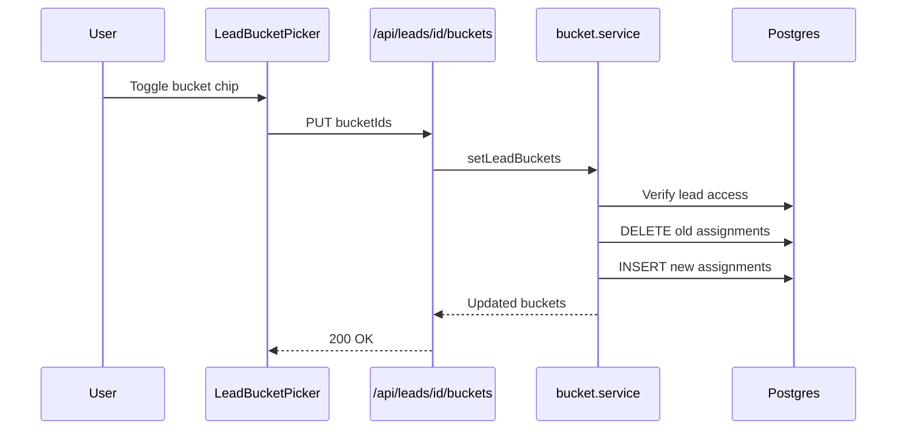

# Flowcharts — Lead buckets

```mermaid
flowchart TD
  Admin[Admin] --> BucketsPage[/buckets page]
  BucketsPage --> CreateAPI[POST /api/buckets]
  CreateAPI --> DB[(lead_buckets)]

  Caller[Tele-caller / Admin] --> LeadDetail[Lead detail Interests]
  LeadDetail --> Picker[LeadBucketPicker]
  Picker --> TagAPI[PUT /api/leads/id/buckets]
  TagAPI --> AssignDB[(lead_bucket_assignments)]
  AssignDB --> Leads[(leads)]

  BucketsPage --> DetailAPI[GET /api/buckets/id?include=leads]
  DetailAPI --> AssignDB
```


